# Proyecto - Dando vida a los objetos de una tienda de regalos para la gestión de inventarios

## Objetivo General:
Desarrollar una aplicación de consola en Java que gestione el inventario de una tienda de regalos, aplicando los principios fundamentales de la programación orientada a objetos (POO), el manejo de excepciones y la persistencia de datos en archivos. 

El proyecto busca que el estudiante comprenda y aplique conceptos como clases, objetos, herencia, encapsulamiento, polimorfismo, relaciones entre clases y arquitectura en capas, resolviendo problemas reales de gestión de inventarios.

## Objetivos Específicos:
Modelar entidades del mundo real: Representar productos y actores relevantes de una tienda de regalos como clases Java, identificando atributos y comportamientos adecuados.
- Aplicar encapsulamiento: Proteger los datos internos de las clases y proporcionar acceso controlado mediante métodos públicos (getters y setters).

- Implementar herencia y polimorfismo: Crear jerarquías de clases para reutilizar código y permitir el tratamiento uniforme de diferentes tipos de productos.

- Gestionar relaciones entre clases: Definir y manejar asociaciones, agregaciones y composiciones entre las distintas entidades del sistema.

- Desarrollar un sistema de inventario: Permitir la adición, eliminación, búsqueda, listado y actualización de productos en el inventario de la tienda.
Manejar excepciones: Implementar el manejo adecuado de errores para asegurar la robustez y confiabilidad de la aplicación.

- Persistir información en archivos: Leer y escribir datos de productos y usuarios en archivos para mantener la información entre ejecuciones.

- Separar responsabilidades en capas: Organizar el código en capas (presentación, negocio y datos) para mejorar la mantenibilidad y escalabilidad del sistema.

- Desarrollar habilidades de resolución de problemas: Analizar requerimientos, diseñar soluciones orientadas a objetos y traducirlas a código funcional y probado.

## Arquitectura de Tres Capas

Este proyecto sigue una arquitectura de tres capas para asegurar una separación clara de responsabilidades y mejorar la mantenibilidad del código. Las tres capas son:

Capa de Presentación (UI):

Se encarga de la interacción con el usuario (entrada y salida por consola).
Ejemplo: Clases en el paquete ui o presentacion como Menu, Principal, etc.

Capa de Negocio (Business Logic):

Contiene la lógica de negocio, validaciones y reglas del sistema.
Ejemplo: Clases en el paquete negocio como servicios, lógica de inventario, descuentos, etc.

Capa de Datos (Data Access):

Maneja la persistencia y recuperación de datos (archivos, DAO, entidades).
Ejemplo: Clases en el paquete datos como ProductoDAO, entidades de producto, usuario, etc.


## Introducción:

El objetivo principal de esta práctica es que te familiarices con los conceptos fundamentales de la programación orientada a objetos (POO) y la gestión de inventarios, mediante el desarrollo de una aplicación de consola para una tienda de regalos.  
Al finalizar esta práctica, serás capaz de:

- Modelar entidades del mundo real como objetos de software utilizando clases Java.
- Definir atributos y métodos adecuados para caracterizar objetos.
- Aplicar principios de encapsulamiento para proteger los datos internos de las clases.
- Crear e instanciar objetos, así como interactuar con ellos mediante sus métodos.
- Comprender y aplicar relaciones entre clases (asociación, agregación, composición y herencia).
- Implementar y gestionar un sistema de inventario para una tienda de regalos.
- Aplicar conceptos de herencia y polimorfismo para reutilizar código y tratar uniformemente diferentes tipos de productos.
- Manejar excepciones para asegurar la robustez y confiabilidad de la aplicación.
- Persistir información en archivos para mantener los datos entre ejecuciones.
- Desarrollar habilidades de análisis, diseño y codificación de soluciones orientadas a objetos.

## Desarrollo de la Práctica:

El desarrollo de esta práctica consiste en implementar una aplicación de consola en Java para gestionar el inventario de una tienda de regalos, aplicando los principios fundamentales de la programación orientada a objetos (POO). 

El proyecto se estructura en varias etapas, comenzando con la definición de clases base como Producto, que sirve como superclase para diferentes tipos de productos (literarios, electrónicos, electrodomésticos y promocionales). A partir de esta base, se implementan subclases específicas como Libro, Televisión, Celular, entre otras, aplicando herencia y polimorfismo para reutilizar código y tratar uniformemente los productos. Además, se desarrollan clases de utilidad como MiColeccion para gestionar colecciones de productos, y se implementan interfaces como Vendible para definir comportamientos comunes. 

La práctica también incluye el manejo de excepciones personalizadas para garantizar la robustez de la aplicación, así como la persistencia de datos en archivos para mantener la información entre ejecuciones. 

Finalmente, se integran todas las funcionalidades en una clase principal (TiendaDeRegalos) y se desarrollan pruebas unitarias para validar el correcto funcionamiento del sistema.

## Entregables:

- Código fuente:
El código fuente de las clases en un repositorio, con algunos errores intencionales para que los estudiantes los identifiquen y corrijan.

- Pruebas unitarias:
Un conjunto de pruebas unitarias que los estudiantes deberán ejecutar y hacer pasar corrigiendo los errores en el código.

- Diagrama de clases UML:
Un diagrama de clases que represente la estructura del sistema, incluyendo las clases, relaciones y jerarquías.

- Programa principal:
Una clase principal (Principal) que demuestre el uso básico de las funcionalidades del sistema.

- Documentación:
Una explicación de las decisiones de diseño tomadas, incluyendo comentarios en el código y un archivo README con instrucciones para compilar, ejecutar y probar el proyecto.

## Pruebas Unitarias

El proyecto incluye un conjunto de pruebas unitarias diseñadas para validar el correcto funcionamiento de las funcionalidades principales del sistema. Estas pruebas contienen casos específicos que los estudiantes deberán analizar y corregir para que pasen correctamente. A continuación, se describen las pruebas incluidas y su objetivo:

### Lista de Pruebas:

1. **`testCalcularValorTotalConProductosAgregados`**  
   - **Objetivo:** Verificar que el cálculo del valor total del inventario sea correcto después de agregar productos.

2. **`testAplicarDescuentoATodos`**  
   - **Objetivo:** Validar que los descuentos se apliquen correctamente a todos los productos del inventario.

3. **`testMostrarInventario`**  
   - **Objetivo:** Comprobar que el inventario se muestre correctamente y que contenga los productos esperados.

4. **`testVenderProductoExistente`**  
   - **Objetivo:** Verificar que un producto existente se pueda vender y desaparezca del inventario.

5. **`testNoVenderProductoPromocional`**  
   - **Objetivo:** Asegurar que los productos promocionales no se puedan vender.

6. **`testMenuInitialization`**  
   - **Objetivo:** Validar que el menú se inicialice correctamente con un usuario autenticado.

7. **`testProducto`**  
   - **Objetivo:** Probar los métodos getter y setter de la clase `Producto` (usando un `Libro` como ejemplo).

8. **`testAplicarDescuentoHerenciaProducto`**  
   - **Objetivo:** Verificar que los descuentos se apliquen correctamente a productos de la clase base `Producto`.

9. **`testAplicarDescuentoHerenciaProductoElectronico`**  
   - **Objetivo:** Validar que los descuentos se apliquen correctamente a productos electrónicos.

10. **`testAplicarDescuentoHerenciaProductoElectroDomestico`**  
    - **Objetivo:** Comprobar que los descuentos se apliquen correctamente a productos electrodomésticos.

11. **`testAplicarDescuentoHerenciaProductoLiterario`**  
    - **Objetivo:** Validar que los descuentos se apliquen correctamente a productos literarios.

12. **`testPolimorfismoProducto`**  
    - **Objetivo:** Verificar el polimorfismo y la correcta pertenencia de instancias a sus clases y subclases.

13. **`testAplicarDescuentoHerenciaProductoPromocional`**  
    - **Objetivo:** Validar que los descuentos no se apliquen a productos promocionales, ya que no tienen lógica de descuento.

14. **`testMiColeccionOperacionesBasicas`**  
    - **Objetivo:** Probar las operaciones básicas de la colección personalizada `MiColeccion` (agregar, eliminar, limpiar).

15. **`testListarProductosOrdenadosPorID`**  
    - **Objetivo:** Verificar que los productos se ordenen correctamente por ID al listarlos.

16. **`testCapturaConNavegacion`**  
    - **Objetivo:** Simular la captura de datos de un producto a través del menú y verificar que los datos capturados sean correctos.

17. **`testProductoDAO`**  
    - **Objetivo:** Probar la persistencia de productos: agregar, buscar, eliminar y verificar el tamaño de la colección.


## Diagrama de clases
[Editor en línea](https://mermaid.live/)

```mermaid
---
title: Diagrama de Clases - Tienda de Regalos
---
classDiagram

    class TiendaDeRegalos { 
        -String nombre
        -String direccion
        -List~Producto~ productos
        +TiendaDeRegalos(String nombre, String direccion)
        +void presentarse()
        +void cumplirAnios()
        +void agregarProducto(Producto producto)
        +void eliminarProducto(String idProducto)
        +Producto buscarProducto(String idProducto)
        +List~Producto~ listarProductos()
        +void venderProducto(String idProducto)
        +void actualizarPrecio(String idProducto, double nuevoPrecio)
        +double calcularValorInventario()
    }

    class Producto {
        -String idProducto
        -String nombre
        -double precio
        -String descripcion
        -String familia
        +Producto(String idProducto, String nombre, double precio, String descripcion, String familia)
        +String getIdProducto()
        +void setIdProducto(String idProducto)
        +String getNombre()
        +void setNombre(String nombre)
        +double getPrecio()
        +void setPrecio(double precio)
        +String getDescripcion()
        +void setDescripcion(String descripcion)
        +String getFamilia()
        +void setFamilia(String familia)
        +String toString()
        +abstract String obtenerDetalles()
        +abstract boolean aplicarDescuento(double porcentaje)
        +abstract boolean esVendible()
        +abstract String toArchivo()
    }

    class MiColeccion~T~ {
        -List~T~ elementos
        +MiColeccion()
        +void agregar(T elemento)
        +boolean eliminar(T elemento)
        +T obtener(int indice)
        +int tamano()
        +Iterator~T~ iterator()
        +List~T~ aLista()
        +void ordenar(Comparator~T~ comparador)
    }

    class Vendible {
        <<interface>>
        +boolean esVendible()
    }

    %% Jerarquía de productos
    Producto <|-- ProductoLiterario
    Producto <|-- ProductoElectronico
    Producto <|-- ProductoElectroDomestico
    Producto <|-- ProductoPromocional

    %% Productos literarios
    class ProductoLiterario {
        -String autor
        -String editorial
        -int anioPublicacion
        -String genero
        -int numeroPaginas
        +ProductoLiterario(String idProducto, String nombre, double precio, String descripcion, String familia, String autor, String editorial, int anioPublicacion, String genero, int numeroPaginas)
        +String getAutor()
        +void setAutor(String autor)
        +String getEditorial()
        +void setEditorial(String editorial)
        +int getAnioPublicacion()
        +void setAnioPublicacion(int anio)
        +String getGenero()
        +void setGenero(String genero)
        +int getNumeroPaginas()
        +void setNumeroPaginas(int paginas)
    }
    ProductoLiterario <|-- Libro
    class Libro {
        -String isbn
        +Libro(String idProducto, String nombre, double precio, String descripcion, String familia, String autor, String editorial, int anioPublicacion, String genero, int numeroPaginas, String isbn)
        +String getIsbn()
        +void setIsbn(String isbn)
    }

    %% Productos electrónicos
    class ProductoElectronico {
        -String marca
        -String modelo
        -String color
        -int garantia
        -String voltaje
        +ProductoElectronico(String idProducto, String nombre, double precio, String descripcion, String familia, String marca, String modelo, String color, int garantia, String voltaje)
        +String getMarca()
        +void setMarca(String marca)
        +String getModelo()
        +void setModelo(String modelo)
        +String getColor()
        +void setColor(String color)
        +int getGarantia()
        +void setGarantia(int garantia)
        +String getVoltaje()
        +void setVoltaje(String voltaje)
    }
    ProductoElectronico <|-- Television
    class Television {
        -String tamanio
        -String resolucion
        -String tipoPantalla
        +Television(String idProducto, String nombre, double precio, String descripcion, String familia, String marca, String modelo, String color, int garantia, String voltaje, String tamanio, String resolucion, String tipoPantalla)
        +String getTamanio()
        +void setTamanio(String tamanio)
        +String getResolucion()
        +void setResolucion(String resolucion)
        +String getTipoPantalla()
        +void setTipoPantalla(String tipoPantalla)
    }
    ProductoElectronico <|-- Celular
    class Celular {
        -int numCamaras
        -String sistemaOperativo
        -int capacidadAlmacenamiento
        -int ram
        -String tipoPantalla
        +Celular(String idProducto, String nombre, double precio, String descripcion, String familia, String marca, String modelo, String color, int garantia, String voltaje, int numCamaras, String sistemaOperativo, int capacidadAlmacenamiento, int ram, String tipoPantalla)
        +int getNumCamaras()
        +void setNumCamaras(int numCamaras)
        +String getSistemaOperativo()
        +void setSistemaOperativo(String sistemaOperativo)
        +int getCapacidadAlmacenamiento()
        +void setCapacidadAlmacenamiento(int capacidadAlmacenamiento)
        +int getRam()
        +void setRam(int ram)
        +String getTipoPantalla()
        +void setTipoPantalla(String tipoPantalla)
    }
    ProductoElectronico <|-- Calculadora
    class Calculadora {
        -String tipo
        +Calculadora(String idProducto, String nombre, double precio, String descripcion, String familia, String marca, String modelo, String color, int garantia, String voltaje, String tipo)
        +String getTipo()
        +void setTipo(String tipo)
    }

    %% Productos electrodomésticos
    class ProductoElectroDomestico {
        -String marca
        -String modelo
        -String color
        -int garantia
        -String voltaje
        +ProductoElectroDomestico(String idProducto, String nombre, double precio, String descripcion, String familia, String marca, String modelo, String color, int garantia, String voltaje)
        +String getMarca()
        +void setMarca(String marca)
        +String getModelo()
        +void setModelo(String modelo)
        +String getColor()
        +void setColor(String color)
        +int getGarantia()
        +void setGarantia(int garantia)
        +String getVoltaje()
        +void setVoltaje(String voltaje)
    }
    ProductoElectroDomestico <|-- Licuadora
    class Licuadora {
        -int potencia
        -int capacidad
        +Licuadora(String idProducto, String nombre, double precio, String descripcion, String familia, String marca, String modelo, String color, int garantia, String voltaje, int potencia, int capacidad)
        +int getPotencia()
        +void setPotencia(int potencia)
        +int getCapacidad()
        +void setCapacidad(int capacidad)
    }
    ProductoElectroDomestico <|-- Tostadora
    class Tostadora {
        -int numRanuras
        +Tostadora(String idProducto, String nombre, double precio, String descripcion, String familia, String marca, String modelo, String color, int garantia, String voltaje, int numRanuras)
        +int getNumRanuras()
        +void setNumRanuras(int numRanuras)
    }

    %% Productos promocionales
    class ProductoPromocional {
        +ProductoPromocional(String idProducto, String nombre, double precio, String descripcion, String familia)
    }
    ProductoPromocional <|-- Camisetapromocional
    class Camisetapromocional {
        -String talla
        -String color
        +Camisetapromocional(String idProducto, String nombre, double precio, String descripcion, String familia, String talla, String color)
        +String getTalla()
        +void setTalla(String talla)
        +String getColor()
        +void setColor(String color)
    }

    %% Servicio y DAO
    class TiendaDeRegalosService {
        -ProductoDAO productoDAO
        +TiendaDeRegalosService(int capacidad, String ruta, String nombreUsuario, String emailUsuario)
        +void agregarProducto(Producto producto)
        +void eliminarProducto(String nombreProducto)
        +Producto buscarProducto(String nombreProducto)
        +List~Producto~ listarProductos()
        +void venderProducto(String nombreProducto)
        +void actualizarPrecio(String nombreProducto, double nuevoPrecio)
        +void aplicarDescuento(String nombreProducto, double porcentaje)
        +void aplicarDescuentoATodos(double porcentaje)
        +String generarReporteProductosConEncabezadoId()
        +String generarReporteProductosConEncabezadoNombre()
        +String generarReporteProductosConEncabezadoPrecio()
    }
    class ProductoDAO {
        +ProductoDAO(int capacidad, String ruta)
        +void agregarProducto(Producto producto)
        +boolean eliminarProducto(String nombreProducto)
        +Producto buscarProducto(String nombreProducto)
        +List~Producto~ listarProductos()
        +void actualizarProducto(Producto producto)
        +String getRuta()
        +int getRegistros()
    }

    %% Relaciones
    TiendaDeRegalos "1" o-- "*" Producto : productos
    Producto <|.. Vendible
    TiendaDeRegalosService --> ProductoDAO
    TiendaDeRegalos --> MiColeccion~Producto~


```

```mermaid
---
title: Diagrama de Clases - Tienda de Regalos (Completo con Utilidades)
---
classDiagram

    class TiendaDeRegalos { 
        -String nombre
        -String direccion
        -MiColeccion~Producto~ productos
        +TiendaDeRegalos(String nombre, String direccion)
        +void agregarProducto(Producto producto)
        +void eliminarProducto(String idProducto)
        +Producto buscarProducto(String idProducto)
        +MiColeccion~Producto~ listarProductos()
        +void venderProducto(String idProducto)
        +void actualizarPrecio(String idProducto, double nuevoPrecio)
    }

    class Producto {
        -String idProducto
        -String nombre
        -double precio
        -String descripcion
        +abstract String obtenerDetalles()
        +abstract boolean aplicarDescuento(double porcentaje)
    }

    class MiColeccion~T~ {
        -List~T~ elementos
        +void agregar(T elemento)
        +boolean eliminar(T elemento)
        +void ordenar(Comparator~T~ comparador)
        +Iterator~T~ iterator()
    }

    class ProductoLiterario {
        -String autor
        -String editorial
        -int anioPublicacion
    }

    class ProductoElectronico {
        -String marca
        -String modelo
        -String voltaje
    }

    class ProductoElectroDomestico {
        -int potencia
        -int capacidad
    }

    class ProductoPromocional {
        -String talla
        -String color
    }

    class Vendible {
        <<interface>>
        +boolean esVendible()
    }

    class Comparator~T~ {
        <<interface>>
        +int compare(T o1, T o2)
    }

    class Iterator~T~ {
        <<interface>>
        +boolean hasNext()
        +T next()
    }

    class ProductoNoEncontradoException {
        +ProductoNoEncontradoException(String mensaje)
    }

    class PrecioInvalidoException {
        +PrecioInvalidoException(String mensaje)
    }

    %% Clases e interfaces de utilidades
    class ArchivoUtilidades {
        +static void guardarArchivo(String ruta, String contenido)
        +static String leerArchivo(String ruta)
    }

    class OrdenarPorNombre {
        <<interface>>
        +int compare(Producto p1, Producto p2)
    }

    class OrdenarPorPrecio {
        <<interface>>
        +int compare(Producto p1, Producto p2)
    }

    %% Relaciones
    TiendaDeRegalos "1" o-- "*" Producto : productos
    Producto <|-- ProductoLiterario
    Producto <|-- ProductoElectronico
    Producto <|-- ProductoElectroDomestico
    Producto <|-- ProductoPromocional
    Producto <|.. Vendible
    TiendaDeRegalos --> MiColeccion~Producto~
    MiColeccion~T~ ..> Iterator~T~ : implementa
    MiColeccion~T~ ..> Comparator~T~ : usa
    TiendaDeRegalos ..> ProductoNoEncontradoException : lanza
    TiendaDeRegalos ..> PrecioInvalidoException : lanza
    ArchivoUtilidades ..> Producto : opera_con
    OrdenarPorNombre ..|> Comparator~Producto~ : implementa
    OrdenarPorPrecio ..|> Comparator~Producto~ : implementa

```





[Referencia-Mermaid](https://mermaid.js.org/syntax/classDiagram.html)

## Diagrama de clases UML con draw.io
El repositorio está configurado para crear Diagramas de clases UML con ```draw.io```. Para usarlo simplemente agrega un archivo con extensión ```.drawio.png```, das doble clic sobre el mismo y se activará el editor ```draw.io``` incrustado en ```VSCode``` para edición. Asegúrate de agregar las formas UML en el menú de formas del lado izquierdo (opción ```+Más formas```).

## Uso del proyecto con make

### Default - Compilar+Probar+Ejecutar
```
make
```
### Compilar
```
make compile
```
### Probar todo
```
make test
```
### Ejecutar App
```
make run
```
### Limpiar binarios
```
make clean
```
## Comandos Git-Cambios y envío a Autograding

### Por cada cambio importante que haga, actualice su historia usando los comandos:
```
git add .
git commit -m "Descripción del cambio"
```
### Envíe sus actualizaciones a GitHub para Autograding con el comando:
```
git push origin main
```
## Comandos individuales
### Compilar

```
find ./ -type f -name "*.java" > compfiles.txt
javac -d build -cp lib/junit-platform-console-standalone-1.5.2.jar @compfiles.txt
```
Ejecutar ambos comandos en 1 sólo paso:

```
find ./ -type f -name "*.java" > compfiles.txt ; javac -d build -cp lib/junit-platform-console-standalone-1.5.2.jar @compfiles.txt
```


### Ejecutar Todas la pruebas locales de 1 Test Case

```
java -jar lib/junit-platform-console-standalone-1.5.2.jar -class-path build --select-class miTest.AppTest
```
### Ejecutar 1 prueba local de 1 Test Case

```
java -jar lib/junit-platform-console-standalone-1.5.2.jar -class-path build --select-method miTest.AppTest#appHasAGreeting
```
### Ejecutar App
```
java -cp build miPrincipal.Principal
```
Los comandos anteriores están considerados para un ambiente Linux. [Referencia.](https://www.baeldung.com/junit-run-from-command-line)
